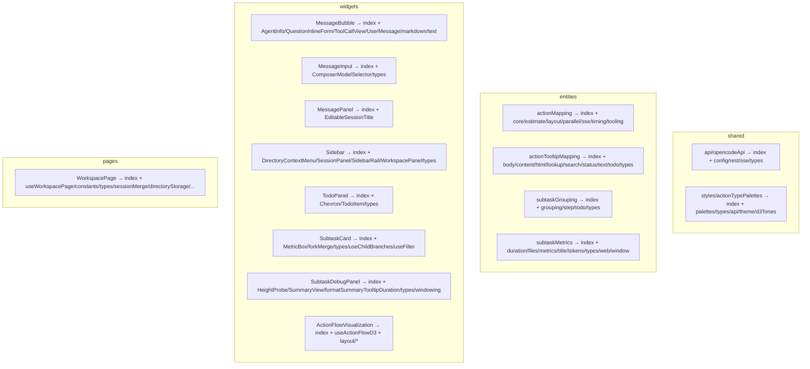

# Отчёт о рефакторинге: внедрение Feature-Sliced Design

Дата: 2026-08-20
Ветка: `refactor/fsd`

## Цель

Привести код к Feature-Sliced Design (FSD): каждый слой (`shared`, `entities`,
`features`, `widgets`, `pages`, `app`) содержит папки слайсов, публичные API
которых раскрывается через `index.ts(x)`-барель. Монолиты размером до 2334 строк
декомпозированы на папки с сохранением поведения без изменений.

## Результат

Рефакторинг прошёл в два коммита:

| Коммит    | Что сделано                                                         |
| --------- | ------------------------------------------------------------------- |
| `c67971c` | Внедрение каркаса FSD: структура слайсов, контексты и маршрутизация |
| `622fc99` | Декомпозиция 15 монолитов на папки с барель-экспортом               |

Итог по файлам: **103 файла изменено, +8968 / −8143 строк**.

## Декомпозированные монолиты

## Декомпозиция ActionFlowVisualization

Самый крупный монолит (2334 строки) разбит на:

- `index.tsx` — компонент-барель: props из `layout/types`, JSX и визуальное
  обрамление (скролл, tooltip, контекстное меню).
- `useActionFlowD3.ts` — хук с рендер-эффектом и dimming-эффектом (1067 строк),
  принимает весь объект `Props`, возвращает refs, tooltip и layout.
- `layout/` — чистые функции и константы:

| Модуль               | Содержимое                                              |
| -------------------- | ------------------------------------------------------- |
| `constants.ts`       | Константы лейаута (отступы, высоты, минимумы)           |
| `types.ts`           | `FlowNode`, `FlowLayoutItem`, `FlowEndSummary`, `Props` |
| `duration.ts`        | Ширина блоков и зазоров, форматирование длительности    |
| `positions.ts`       | `rowTopY`, `laneOffsetY`, `verticalCenterOffsetY`       |
| `sessionClassify.ts` | Классификация веток и рядов                             |
| `flowEndTooltip.ts`  | HTML-tooltip финального узла                            |
| `edges.ts`           | Ортогональные рёбра, fan-in/fan-out                     |
| `computeLayout.ts`   | Основная раскладка (644 строки)                         |

## Методология и верификация

Каждый монолит разбивался одинаково:

1. **`git mv`** файла в папку с `index.tsx`, чтобы внешние импорты `@/...`
   продолжали работать.
2. Тела функций и JSX переносились **дословно** — поведение сохраняется точно,
   включая тексты ошибок и комментарии.
3. Оркестрация (эффекты, состояние, d3) выносилась в хук
   `use<Name>.ts`, чистые функции и константы — в модули.
4. Публичный API бареля повторял исходный экспорт файла (default-экспорт +
   дополнительный тип при наличии).

Каждое разбиение проверялось:

- `npx tsc -b` — EXIT 0 (строгий TS: `verbatimModuleSyntax`,
  `noUnusedLocals`, `noUnusedParameters`, `erasableSyntaxOnly`);
- `npm run build` — EXIT 0;
- `npm run lint` — EXIT 0;
- нормализованный diff тел функций против `git show HEAD:<file>` — полное
  совпадение;
- `format:check` — только новые файлы чисты (83 предсуществующих замечания
  Prettier в ранее разобранных модулях остались нетронутыми).

## Итоговые проверки

| Проверка                               | Результат          |
| -------------------------------------- | ------------------ |
| `tsc -b`                               | ✓                  |
| `build`                                | ✓                  |
| `lint`                                 | ✓                  |
| `format:check` (новые файлы)           | ✓                  |
| Единственный потребитель `SubtaskCard` | ✓ (default-импорт) |
