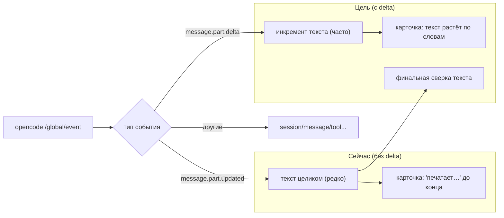

# VibeTrace — предложения по улучшению и баг-репорты

Дата: 21.08.2026
Статус: черновик (предложения не реализованы, баги задокументированы)

---

## 1. Настоящий стриминг текста по словам (приоритет: высокий)

### Проблема

Пользователь не видит, как нейросеть «пишет» по словам/буквам — текст ассистента появляется
в карточке либо сразу целиком, либо редкими крупными кусками. Это была исходная жалоба,
из-за которой появилась планка `печатает…` как временное решение.

### Причина

opencode через REST API шлёт по `GET /global/event` несколько типов событий, из которых мы
обрабатывали только `message.part.updated`:

```text
message.part.updated -> "part": { "type": "text", "text": "<весь текст части на данный момент>" }
```

Проверка (SSE-дамп) показала, что `message.part.updated` для текстовой части приходит с
длинами текста `0, 0, 51` — то есть во время генерации сервер присылает пустые обновления,
а полный текст — только в самом конце. По-токенного роста текста в `part.updated` нет.

Однако в том же дампе было обнаружено событие, которое мы не обрабатывали:

```text
message.part.delta -> {
  "sessionID": "ses_...",
  "messageID": "msg_...",
  "partID": "prt_...",
  "field": "text",
  "delta": "7"
}
```

`message.part.delta` несёт **инкрементальную дельту текста** (`field: "text"`), т.е. именно
то, что даёт настоящий потоковый вывод по токенам.

### Решение

В обработчике SSE (`useWorkspacePage.ts`, секция `message.part.delta`) реализовано
инкрементальное накопление текста:

- по `sessionID`/`messageID`/`partID` найти (или создать, как в fast-path для
  `part.updated`) часть типа `text`;
- добавить `delta` к текущему `text` части;
- не делать полный refetch;
- вызвать `setMessages(msgs)` (с сохранением стабильности через существующий механизм
  `setMessagesStable` / pending-сообщений).

### Нюансы

- `delta` может приходить и для других полей (например, для стриминга tool-состояний) —
  фильтруем по `field === 'text'` и типу части.
- Если часть с `partID` ещё не материализована (дельты приходят раньше `part.updated`
  ассистента или с другим id, чем user-echo) — дописываем к последней text/reasoning
  части сообщения; если таковых нет — создаём text-часть с дельтой.
- `part.updated` с полным текстом служит финальной «сверкой».
- Наблюдаемое поведение (проверено 21.08.2026): deepseek-chat и deepseek-reasoner через
  opencode шлют `message.part.delta` с `field: "text"`.

### Вывод по блочной выдаче opencode (важно)

opencode отдаёт ответ **пачками дельт** (по несколько слов за событие), а не равномерным
потоком по одному слову — события приходят сгруппированно. Поэтому визуально текст всё
равно появляется «кусками»: планка `печатает…` может держаться почти всю генерацию, а
затем прийти сразу несколько слов. Это свойство API/провайдера, а не потеря данных.

Главное, что даёт обработка delta: **текст больше не теряет конец** — раньше при
необработанном delta конец ответа (в т.ч. дума) обрывался и отображался только после
следующего полного refetch. Теперь текст всегда доходит до конца.

---

## 2. Diff-вью изменённых файлов в сообщении (приоритет: средний)

### Проблема

В интерфейсе есть итоговая сводка сессии и раскрашенные тул-блоки, но нет наглядного
показа того, какие файлы и как были изменены в рамках конкретного ответа ассистента.

### Что уже есть в данных

- `session.diff` — SSE-событие с массивом `FileDiff` (`{ file, before, after, additions, deletions }`);
- у сообщений могут быть части типа `patch` (`{ hash, files: string[] }`) и `snapshot`;
- в `Session.summary` есть `additions`/`deletions`/`files`.

### Решение

- Добавить в карточку ассистента (или в планку сводки) секцию «Файлы»: список изменённых
  файлов с `+N/−M` и цветом (зелёный/красный), по клику — раскрывающийся diff.
- Использовать `session.diff` для отображения в реальном времени, пока агент работает.
- Переиспользовать существующий компонент подсветки diff, если есть (проверить в кодовой
  базе); при отсутствии — добавить лёгкий `React`-рендер унифицированного diff.

---

## 3. Undo / Redo редактирования сообщений (приоритет: средний)

### Проблема

После редактирования (revert + переотправка) нет возможности вернуть предыдущую версию
текста или откатить последнее изменение.

### Что уже есть в opencode

- `session.revert({ messageID, partID? })` — POST `/session/{id}/revert`;
- `session.unrevert()` — POST `/session/{id}/unrevert` (восстановление откатанных сообщений);
- тип `Session.revert` хранит `{ messageID, partID?, snapshot?, diff? }`.

### Решение

- Добавить в `rest.ts` функцию `unrevertSession(sessionId, directory?)`.
- В UI рядом с `edit`/`copy` добавить кнопку «отменить» (undo), активную, если у сессии
  есть `revert`.
- Повторный `edit` должен перезаписывать точку отката; `undo` — вызывать `unrevert` и
  перезагружать сообщения.

---

## 4. Связка reasoning/правой панели с сообщением (приоритет: низкий)

### Проблема

В правой панели уже есть подсветка сообщений по индексу (`highlightMessageIndices`),
но при выборе узла `Think` в flow можно прокручивать чат к соответствующему reasoning-блоку.

### Решение

- При клике на узел `Think` в flow-панели вызывать `messageScrollToIndexRef.current(index)`.
- Обратное: клик по reasoning-блоку в чате — подсвечивать узел в правой панели (если
  есть связка по `messageID`/`partID`).
- Понадобится проверить, есть ли в данных правой панели `partID` reasoning-части.

---

## 5. Горячие клавиши (приоритет: низкий)

### Предложение

- `⌘/Ctrl + C` над user-сообщением — скопировать;
- `⌘/Ctrl + E` над user-сообщением — редактировать;
- `Escape` в режиме редактирования — отмена.
- Реализовать через делегирование keydown на контейнер списка с проверкой фокуса, чтобы
  не перехватывать ввод в композере/textarea.

---

## 6. Автосхлопывание старых tool-блоков (приоритет: низкий)

### Проблема

В длинных сессиях (проверено на сессии с 1800+ сообщениями) большая часть высоты — это
развёрнутые или крупные tool-блоки; пролистывание к последнему ответу занимает время.

### Решение

- Tool-блоки старше N сообщений от текущего конца отображать схлопнутыми (заголовок +
  «N тулов выше»), раскрытие по клику.
- Не трогать reasoning-блоки и последние 1–2 тула.
- Добавить переключатель «схлопнуть старые тулы» в шапке чата.

---

## 7. Баг: тулы, зависшие в `running`, навсегда пульсируют в timeline (приоритет: высокий)

### Проблема

В timeline некоторые tool-блоки показываются как **выполняющиеся (running) вечно**:
синяя пульсирующая обводка (`action-flow-running`) и статус `running` в тултипе, хотя
сессия давно завершена или ушла вперёд. Пользователь видит «висящий» спиннер и не может
понять, работает ли тул на самом деле.

Проверено по живым данным (21.08.2026, 7 сессий в директории VibeTrace, ~6000 действий):

```text
[ses_fdef] bash  call=call_a49  status=running   <- застрял навсегда
[ses_fe41] bash  call=call_00_  status=running   <- застрял навсегда
```

Всего тулов с не-терминальным статусом — 60: **2 зависших `running`** и 58 `error`
(ошибки — рабочий мусор: `edit` с несовпадением oldString, `playwright_*` с битыми
рефами/таймаутами, `websearch` 403, `webfetch` 404 и т.п.). Error-тулы рендерятся
корректно — красным, проблемы они не создают.

### Причина

1. **Первопричина — на стороне opencode:** когда сессия умирает во время выполнения
   тула (kill процесса, обрыв сети, ручной abort), финальное событие состояния
   (`completed`/`error`) в сохранённые данные **не попадает**. Тул остаётся в
   `status=running` навсегда. Это видно в данных `GET /session/{id}/message` —
   часть `tool` с `state.status: "running"` и без `state.time.end`.
2. **Правильно прерванные тулы при этом помечаются как `error`** с сообщением
   `Tool execution aborted` — их VibeTrace уже показывает красным, они не висят:
   ```text
   [ses_fdef] read  call=call_5ea  "Tool execution aborted"
   [ses_fdef] read  call=call_baf  "Tool execution aborted"
   [ses_fdef] bash  call=call_4aa  "Tool execution aborted"
   ```
   То есть баг проявляется только в случае «мёртвой» сессии, а не обычного abort.
3. **Текущий фикс VibeTrace — грубый костыль:** `useWorkspacePage.ts:654-699`
   авто-абортит сессию, если тул висит в `running`/`pending` дольше
   `AUTO_ABORT_STUCK_RUNNING_AFTER_MS = 24 * 60 * 60 * 1000` (24 часа,
   `constants.ts:2`). Порог огромный — весь день пользователь видит пульсацию.
   К тому же фикс дёргает `abortSession(selectedSessionId)` на **всю сессию** целиком
   (прерывая и живые тулы), а не помечает конкретный застрявший callID.

### Влияние на UI/UX

- Визуальный «шум»: вечная синяя пульсация создаёт ложное ощущение активности.
- Тултип и статус вводят в заблуждение: `running` интерпретируется как «выполняется
  прямо сейчас».
- Полоса действий (action-flow) не может корректно посчитать длительность/статус
  застрявшего тула — статистика сессии искажается.
- Единственная страховка (24h авто-аборт) срабатывает настолько поздно, что
  практически бесполезна для UX, и при срабатывании прерывает всю сессию.

### Решение (предложение)

1. **Stale-визуал:** тул в статусе `running`, старше N минут от `state.time.start`,
   рендерить как **«завис (stale)»** — без анимации пульсации, приглушённый цвет
   (например, серый/амбер), в тултипе подпись `stale` вместо `running`.
   Порог — константа (например, 5 минут), конфигурируемая.
2. **Понизить/убрать авто-аборт всей сессии:** вместо `abortSession` на всю сессию
   через 24ч — локальная пометка застрявшего callID (без сетевых запросов), либо
   сократить порог до минут. Полный `abortSession` оставить только для случая, когда
   реально нужно прервать текущую работу пользователя.
3. **На страховку от регресса:** unit-тест на маппинг статусов — убедиться, что
   `running` без `time.end` и старше порога превращается в `stale`.

### Нюансы

- Не все долгие `running` — баг: bash/playwright могут легитимно выполняться минутами.
  Нужен разумный порог и признак «свежести» (от `state.time.start` до `now`).
- Статус может прийти позже (сеть донесёт финальное событие) — stale-метка должна
  автоматически сниматься при приходе `completed`/`error`.
- Проверить, что stale-рендер не конфликтует с существующей логикой
  `action-flow-running-long` (useActionFlowD3.ts:613-616) и цветовой палитрой
  `actionFlowPalette.ts` (completed/running/pending).
- Отличать «сессия давно закрыта, а тул running» (точно stale) от «сессия активна,
  тул реально работает» (не трогать).

### Ожидаемый эффект

Зависшие тулы больше не пульсируют вечно: пользователь сразу видит, что блок «мёртв»,
timeline перестаёт вводить в заблуждение, а тяжёлый авто-аборт всей сессии больше не
нужен для решения этой проблемы.

---

## 8. Ветка и репозиторий в шапке (приоритет: низкий)

### Проблема

Сейчас в шапке сессии показывается заголовок и сводка, но не видно, в каком репозитории
и на какой ветке работает агент. При наблюдении за несколькими сессиями/проектами сложно
сразу понять, где именно идёт работа.

### Что уже есть в данных

- У сообщений есть `info.path.cwd` и `info.path.root` — корень проекта.
- У сессии есть `directory` и `projectID`.
- opencode API: `GET /project`, `GET /path`, событие `vcs.branch.updated` (`{ branch?: string }`),
  которое уже приходит в `/global/event` (проверено в дампах SSE).

### Решение

- В шапке сессии (рядом с `EditableSessionTitle`) показывать бейджи:
  - репозиторий: имя папки из `path.root` (или `directory`);
  - ветку: из SSE `vcs.branch.updated`, кэшировать последнее значение для сессии;
  - статус VCS (dirty/clean), если удаётся получить из `git status` через API.
- Подписываться на `vcs.branch.updated` в SSE-обработчике и хранить `branch` в состоянии
  сессии; при смене сессии — сбрасывать.
- На сервере: если ветку нельзя получить из события, попробовать `GET /project` или
  `file.status` — или просто показать репозиторий без ветки.

### Ожидаемый эффект

Пользователь сразу видит `repo@branch` в шапке и понимает контекст работы агента без
перехода в другие окна.

---

## 9. Diff-вью в блоке edit: показывать +/− как git diff (приоритет: средний)

### Проблема

При редактировании сообщения (`edit` через композер) пользователь видит только новую
версию текста, но не видит, что именно изменилось относительно исходного сообщения.
Для длинных сообщений это затрудняет ревью правки перед отправкой.

### Решение

- В режиме редактирования (когда композер находится в `editMode`) показывать под textarea
  свёрнутый блок «Изменения» с построчным diff между исходным текстом сообщения
  (`editMode.originalText`) и текущим черновиком.
- Строки-удаления — с `-` и красным фоном, строки-добавления — с `+` и зелёным фоном,
  как в git diff; неизменённый контекст — серым.
- Для этого в `editMode` добавить поле `originalText` (текст сообщения до правки);
  MessagePanel уже хранит `editTarget.text` — добавить неизменяемый `originalText`.
- Дифф строить простым алгоритмом LCS по строкам (без внешних зависимостей) или
  переиспользовать существующий рендер diff, если он есть в кодовой базе.
- Обновлять diff в реальном времени при вводе.

### Ожидаемый эффект

Перед «save & resend» пользователь видит, какие строки добавлены/удалены, — как при
просмотре git diff, что снижает риск случайных правок.

### Пример желаемого вида (как в opencode TUI при `edit` файла)

Двухпанельная визуализация: слева — исходный файл с номерами строк, справа — изменённый
с `+` для добавленных и `-` для удалённых строк, затронутые строки подсвечены зелёным
(добавления) и красным (удаления):

```text
← Edit reports/improvements.md

  313 просмотре git diff, что снижает риск случайных правок.      313   просмотре git diff, что снижает риск случайных правок.
  314                                                                 314
  315 ---                                                             315   ---
  316                                                                 316
                                                                      317 + ## 10. Git diff в блоке write (добавление нового файла)
                                                                      318 +
                                                                      319 + ### Проблема
                                                                      320 +
                                                                      321 + Инструмент `write` создаёт/перезаписывает файл целиком...
                                                                      322 + VibeTrace — это просто «весь содержимое файла»...
                                                                      323 + заново — полезно сразу показать, какие строки появились...
                                                                      324 + git diff (`+`).
                                                                      325 +
                                                                      326 + ### Что уже есть в данных
  317 ## Диаграмма потока стриминга (текущее vs целевое)              356   ## Диаграмма потока стриминга (текущее vs целевое)
  318                                                                 357
  319 ```mermaid                                                      358   ```mermaid
```

Реализовать в VibeTrace в виде встроенной панели поверх блока edit/write (не в новом окне):
- удалённые строки — фон красный, префикс `-`;
- добавленные строки — фон зелёный, префикс `+`;
- неизменённый контекст — серый, без префикса;
- номера строк слева и справа; подпись `new file` для полностью нового файла.

---

## 10. Git diff в блоке write (добавление нового файла) (приоритет: средний)

### Проблема

Инструмент `write` (write_to_file) создаёт/перезаписывает файл целиком, и его вывод в
VibeTrace — это просто «весь содержимое файла», без визуальной связи с тем, что было
раньше. В отличие от `edit`, здесь diff важен именно потому, что файл **создаётся
заново** — полезно сразу показать, какие строки появились, как будто это добавление в
git diff (`+`).

### Что уже есть в данных

- `ToolPart` для `write`/`write_to_file`: `state.input` содержит `{ file_path, content }`
  (или аналог), `state.output` — подтверждение.
- `edit`-тулы: `state.input` содержит `{ file_path, old_string, new_string }` — для них
  можно строить diff из полей, а для `write` — сравнивать новое содержимое с
  текущим файлом на диске (через API чтения, если доступно) или помечать все строки `+`.

### Решение

- В `ToolCallCard` для тула `write`/`write_to_file` добавить таб «Diff» (рядом с
  существующими Input/Output).
- Diff строить как:
  - если доступен прежний файл (через `file.read` или из истории частей `patch`/
    `snapshot` сессии) — сравнивать старое и новое содержимое;
  - иначе — показывать новое содержимое полностью со знаком `+` и зелёным фоном
    (весь файл — добавление), с заголовком «new file».
- Переиспользовать тот же LCS-рендер, что предлагается для пункта 9 (diff в блоке edit),
  чтобы визуально всё было одинаково: `+`/`-`, зелёный/красный, контекст серым.
- Для `edit`-тулов можно строить diff из `old_string`/`new_string` без чтения с диска.

### Ожидаемый эффект

Пользователь видит для `write`, что именно записано в файл (все строки — `+`), как в git
diff, а для `edit` — какие строки заменены. Согласованный рендер diff у edit/write делает
историю инструментов читаемой.

---

## Диаграмма потока стриминга (текущее vs целевое)



---

## Статус выполнения

| № | Улучшение | Приоритет | Статус |
|---|-----------|-----------|--------|
| 1 | Стриминг по словам (`message.part.delta`) | Высокий | Реализовано (текст не теряет конец; по-словно зависит от блочной выдачи opencode) |
| 2 | Diff-вью файлов | Средний | Не начато |
| 3 | Undo/Redo редактирования | Средний | Не начато |
| 4 | Связка reasoning ↔ правая панель | Низкий | Не начато |
| 5 | Горячие клавиши | Низкий | Не начато |
| 6 | Автосхлопывание старых тулов | Низкий | Не начато |
| 7 | Баг: тулы, зависшие в `running` (вечная пульсация) | Высокий | Открыт |
| 8 | Ветка и репозиторий в шапке | Низкий | Не начато |
| 9 | Diff-вью в блоке edit (+/− как git diff) | Средний | Не начато |
| 10 | Git diff в блоке write (новый файл = все строки `+`) | Средний | Не начато |
